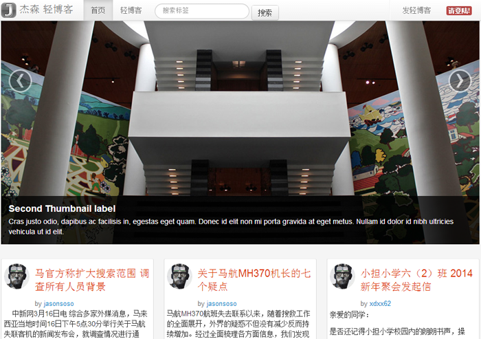
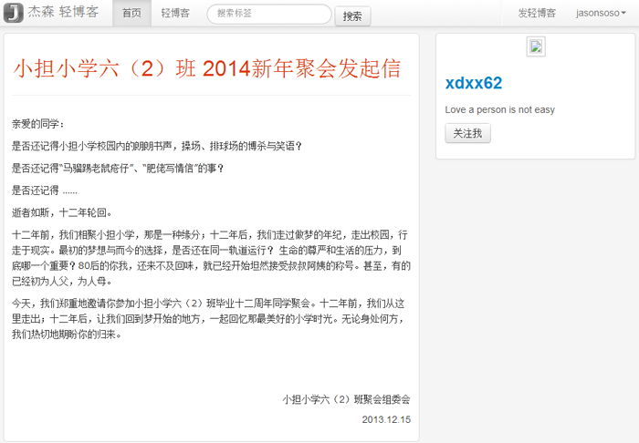

## Introduction ##

Light Blog --- 轻博客	
依赖两个工程包 
[JasonFramewok](https://github.com/jasonsoso/jason-framework "jason-framework")
和
[JasonSecurity](https://github.com/jasonsoso/jason-security "jason-security"),	
轻博客暂时有轻博发布，展示等等		

## Clone and install ##

`git clone https://github.com/jasonsoso/jason-qing.git`   
`cd jason-qing`   
`mvn clean compile`   
`mvn jetty:run  ` 	

call the `http://localhost:8086` url  

## The effect ##

	

